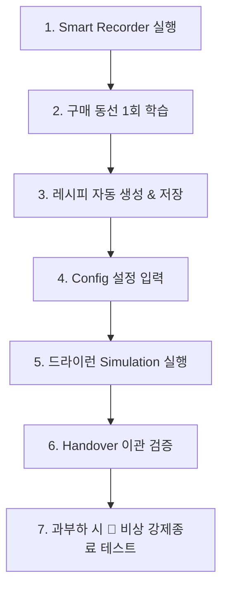

# AutoBuy Assistant — Android Studio 설치부터 스마트폰 배포 및 향후 작업 가이드

> **문서명**: `androidStrudioTask.md`
> **작성 일시**: 2026-08-06
> **프로젝트 경로**: `C:\AutoBuyAssistant`
> **대상**: 개발자 및 테스터

---

## 1. 개요 (Overview)

본 문서는 **AutoBuy Assistant** 프로젝트를 PC에 개발 환경(Android Studio)을 구축하는 단계부터, 물리 안드로이드 스마트폰에 서비스를 설치하고 정상적으로 구동하기 위한 전체 설치 및 설정 가이드, 그리고 무한루프/발열 대비 **🚨 비상 강제 종료 시스템** 활용 및 향후 작업 플랜을 다룹니다.

---

## 2. Step 1: Android Studio 설치 가이드

### 2.1. 공식 설치 파일 다운로드
1. 웹 브라우저에서 공식 다운로드 페이지 접속: [developer.android.com/studio](https://developer.android.com/studio)
2. **Download Android Studio (최신 버전, 예: Jellyfish / Koala 이상)** 버튼 클릭
3. 이용약관 동의 후 `.exe` 설치 파일 다운로드

### 2.2. 설치 진행 (Installation Wizard)
1. 다운로드된 `android-studio-202x.x.x-windows.exe` 실행
2. 설치 옵션 화면:
   - ✅ **Android Studio** (필수)
   - ✅ **Android Virtual Device** (선택)
3. 기본 설치 경로 설정 (`C:\Program Files\Android\Android Studio`) 후 **Next → Install** 클릭
4. 설치 완료 후 **Start Android Studio** 체크 후 **Finish**

### 2.3. 최초 실행 설정 (Setup Wizard)
1. Import Settings 팝업: **Do not import settings** 선택 후 OK
2. Install Type: **Standard** 선택
3. Select UI Theme: **Dark (Darcula)** 선택 (권장)
4. SDK Components Setup: Android SDK, Android SDK Platform, Build-Tools 자동 다운로드 진행
5. **Finish**를 눌러 SDK 다운로드 완료 대기

---

## 3. Step 2: 프로젝트 오픈 및 Gradle Sync

### 3.1. 프로젝트 오픈
1. Android Studio 첫 화면에서 **Open** (또는 메뉴 `File` → `Open`) 클릭
2. 경로 입력 창에 다음 경로 지정 후 OK:
   ```
   C:\AutoBuyAssistant
   ```
3. `Trust Project` 팝업 창이 뜨면 **Trust Project** 클릭

### 3.2. Gradle Sync 진행
1. 프로젝트가 열리면 하단 상태바에서 **Gradle Syncing...** 작업이 시작됩니다.
2. 인터넷 연결 상태에서 필요한 Kotlin Compiler, Hilt, Room, ML Kit 등의 의존성 라이브러리가 자동으로 다운로드됩니다.
3. 하단 `Build` 탭에 **BUILD SUCCESSFUL**이 표시되면 성공적으로 프로젝트가 로드된 것입니다.

---

## 4. Step 3: 스마트폰 (실기기) 개발자 옵션 및 USB 연결

> ⚠️ **주의**: 접근성 서비스(Accessibility Service) 및 화면 캡처(MediaProjection) 기능은 가상 에뮬레이터보다 **물리 안드로이드 스마트폰**에서 테스트하는 것이 가장 정확합니다.

### 4.1. 스마트폰 개발자 옵션 활성화
1. 안드로이드 스마트폰 **설정 (Settings)** 앱 실행
2. **휴대전화 정보 (About Phone)** → **소프트웨어 정보 (Software Information)** 이동
3. **빌드 번호 (Build Number)** 항목을 연속으로 **7회 빠르게 탭**
4. "개발자 모드를 켰습니다" 문구 확인

### 4.2. USB 디버깅 활성화
1. 스마트폰 **설정** 메뉴 최하단의 **개발자 옵션 (Developer Options)** 진입
2. **USB 디버깅 (USB Debugging)** 항목을 찾아 **ON (활성화)**

### 4.3. PC 연결 및 인증
1. USB 케이블로 스마트폰을 PC에 연결
2. 스마트폰 화면에 **"USB 디버깅을 허용하시겠습니까?"** 팝업이 뜨면:
   - ✅ **이 컴퓨터에서 항상 허용** 체크 후 **허용 (Allow)** 탭
3. Android Studio 상단 툴바의 디바이스 선택 드롭다운에 본인의 스마트폰 모델명(예: `Samsung SM-S918N` 등)이 표시되는지 확인

---

## 5. Step 4: 앱 빌드 및 스마트폰 설치

### 5.1. 앱 빌드 및 실행 (Run)
1. Android Studio 상단 툴바에서 타겟 디바이스가 연결된 스마트폰으로 선택되어 있는지 확인
2. 툴바 오른쪽에 있는 초록색 **▶ (Run 'app')** 버튼 클릭 (단축키: `Shift + F10`)
3. 하단 `Gradle Build` 탭에서 빌드 진행 상황 확인
4. 빌드 완료 시 스마트폰에 `AutoBuy Assistant` 앱이 자동으로 설치되고 실행됩니다.

---

## 6. Step 5: 스마트폰 필수 권한 및 백그라운드 구동 설정

> 🚨 **[가장 중요]** 아래 4가지 권한 및 배터리 설정을 완료해야 매크로가 정상 동작합니다.

### 6.1. 접근성 서비스 (Accessibility Service) 활성화
1. 스마트폰 **설정** → **접근성 (Accessibility)** 이동
2. **설치된 앱 (Installed Apps)** 또는 **접근성 서비스** 항목 진입
3. 목록에서 **`AutoBuy 자동화 서비스`** 선택
4. 스위치를 **ON (사용)**으로 변경 후, 권한 승인 팝업에서 **허용** 선택

### 6.2. 배터리 사용량 최적화 제외 (포그라운드 유지)
1. 스마트폰 **설정** → **애플리케이션 (Apps)** → **AutoBuy Assistant** 검색
2. **배터리 (Battery)** 항목 선택
3. **제한 없음 (Unrestricted)**으로 변경 (백그라운드/화면 OFF 시 강제 종료 방지)

### 6.3. 다른 앱 위에 표시 (SYSTEM_ALERT_WINDOW)
1. 스마트폰 **설정** → **애플리케이션** → **AutoBuy Assistant**
2. **다른 앱 위에 표시 (Appear on top)** → **허용 (ON)**

### 6.4. 알림 권한 허용 (Android 13+)
1. 앱 최초 실행 시 노출되는 **알림 권한 요청 팝업**에서 **허용 (Allow)** 선택

---

## 7. 🚨 비상 강제 종료 (Emergency Kill Switch) 사용 방법

매크로 구동 중 **무한루프, CPU 과부하, 스마트폰 발열**이 발생할 시 아래 2가지 방법 중 하나로 모든 프로세스와 스레드를 원클릭 즉시 파기할 수 있습니다.

1. **방법 A (대시보드 앱 상단)**:
   - 앱 메인 대시보드 최상단 붉은색 레스큐 배너의 **`🚨 비상 강제종료`** 버튼 클릭.
2. **방법 B (스마트폰 상단 알림 바 / 잠금화면)**:
   - 스마트폰 상단 알림 바(Notification Shade)를 내려 `AutoBuy Assistant` 상주 알림의 **`🚨 비상 강제종료`** 버튼 클릭.

> 💡 **동작 원리**: 포그라운드 서비스, 고속 폴링 루프, WakeLock, 코루틴 스레드가 즉시 해제되며, `Process.killProcess()`로 앱 프로세스를 자폭시켜 100% 깔끔하게 종료됩니다.

---

## 8. Step 6: 앱 설치 후 진행해야 할 작업 단계 (Next Action Workflow)



### [1단계] Smart Recorder를 이용한 구매 동선 학습 (Recipe 생성)
1. 메인 화면 우측 상단 **비디오 아이콘 (Smart Recorder)** 탭
2. 대상 쇼핑몰/사이트 이름 입력 후 **`레코딩 시작`** 클릭
3. 테스트할 쇼핑몰 앱이나 브라우저로 이동하여 **상품 클릭 → 옵션 선택 → 구매하기 → 결제 화면 진입** 1회 시뮬레이션
4. AutoBuy 앱으로 돌아와 **`레코딩 중단 및 프로필 저장`** 탭

### [2단계] 설정(Config) 등록 및 테스트 실행 (Dry-Run)
1. 메인 화면 **⚙️(설정)** 탭
2. **타겟 URL / 키워드** 및 **오픈 시간** 입력
3. **배송지 및 카드 정보** 입력 (AES-256 암호화 저장)
4. 필요 시 **`(+) 동적 커스텀 필드`** 추가
5. **`[설정 저장 및 자동구매 시작]`** 클릭

### [3단계] 실시간 대시보드 모니터링 & Handover 검증
1. 대시보드 화면에서 **펄스 애니메이션** 및 **실시간 로그 스트림** 확인
2. 최종 결제 버튼 직전에 **긴급 진동 패턴 + 푸시 알림 + 앱 최전면 이관(Handover)** 수신 후 최종 생체인증/비밀번호 입력

---

## 9. 트러블슈팅 및 예외 조치 (Troubleshooting)

### Q1. Android Studio에서 스마트폰이 인식되지 않는 경우
- USB 케이블을 데이터 전송이 가능한 케이블로 교체.
- 스마트폰 브랜드 공식 USB 드라이버(예: 삼성 통합 USB 드라이버) PC에 설치.

### Q2. 무한루프나 발열이 심하게 느껴지는 경우
- 스마트폰 상단 알림 바를 내려 **`🚨 비상 강제종료`** 버튼을 누르면 즉시 모든 백그라운드 스레드가 사멸됩니다.
