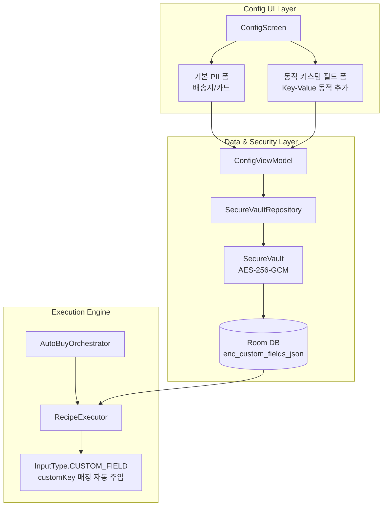

# [작업 상세 내역 2] 설정 시스템, PII 암호화 연동 및 유연한 확장형 아키텍처 구축

> **작성 일시**: 2026-08-05
> **프로젝트 경로**: `C:\AutoBuyAssistant`
> **작성자**: Antigravity AI 수석 아키텍트

---

## 1. 개요 (Overview)

본 작업은 **Phase 2 (설정 시스템 및 유연한 프로필 관리)**의 완전 구현을 다룹니다.
특히 추후 테스트할 대상 사이트나 앱이 결정되었을 때 특수한 입력 필드나 옵션이 추가될 수 있음을 고려하여, **전체 아키텍처(데이터 모델, 보안 저장소, 레시피 스키마, UI)를 유연한 동적 확장 구조(Dynamic Extensible Architecture)**로 설계하고 구축했습니다.

---

## 2. 생성 및 변경된 전체 파일 목록 (Walkthrough Files)

### 🧩 신규 추가 및 확장된 핵심 파일 (9개)

| 파일 | 역할 및 확장성 설계 설명 |
|------|--------------------------|
| [ShopRecipe.kt](file:///C:/AutoBuyAssistant/core/data/src/main/kotlin/com/autobuy/core/data/model/ShopRecipe.kt) | `InputType.CUSTOM_FIELD`, `customKey`, `customData` Map 추가로 미래의 임의 레시피 및 동적 필드 대응 |
| [Entities.kt](file:///C:/AutoBuyAssistant/core/data/src/main/kotlin/com/autobuy/core/data/db/entity/Entities.kt) | `SecureRecordEntity`에 `enc_custom_fields_json` 추가 (동적 커스텀 필드 AES-256 암호화 저장) |
| [SecureVault.kt](file:///C:/AutoBuyAssistant/core/security/src/main/kotlin/com/autobuy/core/security/SecureVault.kt) | `customFields: Map<String, String>` 동적 암호화/복호화 기능 추가 |
| [RecipeExecutor.kt](file:///C:/AutoBuyAssistant/core/accessibility/src/main/kotlin/com/autobuy/core/accessibility/engine/RecipeExecutor.kt) | `CUSTOM_FIELD` 및 `customKey` 해석 주입 로직 추가로 동적 입력 완벽 대응 |
| [ProfileRepository.kt](file:///C:/AutoBuyAssistant/core/data/src/main/kotlin/com/autobuy/core/data/repository/ProfileRepository.kt) | 프로필 조회/저장/삭제 및 Recipe JSON 변환 리포지토리 |
| [SecureVaultRepository.kt](file:///C:/AutoBuyAssistant/core/data/src/main/kotlin/com/autobuy/core/data/repository/SecureVaultRepository.kt) | 배송지/카드 PII 및 커스텀 필드 암호화 저장/로드 리포지토리 |
| [ConfigViewModel.kt](file:///C:/AutoBuyAssistant/feature/config/src/main/kotlin/com/autobuy/feature/config/ConfigViewModel.kt) | 설정 화면 ViewModel (동적 커스텀 필드 목록 제어, 서비스/오케스트레이터 시작 연동) |
| [ConfigScreen.kt](file:///C:/AutoBuyAssistant/feature/config/src/main/kotlin/com/autobuy/feature/config/ConfigScreen.kt) | Compose 설정 UI (타겟 URL, 모드선택, PII 암호화 폼, 동적 커스텀 필드 추가/삭제 UI) |
| [generic_webview_recipe.json](file:///C:/AutoBuyAssistant/core/data/src/main/kotlin/com/autobuy/core/data/assets/recipes/generic_webview_recipe.json) | 임의의 미래 웹뷰/사이트 대응용 범용 레시피 템플릿 |
| [naver_recipe.json](file:///C:/AutoBuyAssistant/core/data/src/main/kotlin/com/autobuy/core/data/assets/recipes/naver_recipe.json) | 네이버쇼핑 내장 레시피 v1.0 |
| [musinsa_recipe.json](file:///C:/AutoBuyAssistant/core/data/src/main/kotlin/com/autobuy/core/data/assets/recipes/musinsa_recipe.json) | 무신사 내장 레시피 v1.0 |

---

## 3. 유연한 확장형 아키텍처 상세 사양

### 3.1. 동적 커스텀 필드 (Dynamic Custom Fields) 구조
- **배경**: 추후 대상 앱/사이트 결정 시 '옵션선택', '쿠폰코드', '보안문자 힌트', '비밀번호' 등 특수한 필드가 추가되더라도 소스 코드를 재배포하지 않고 대응할 수 있도록 설계.
- **UI 지원**: 사용자가 설정 화면에서 `(+) 커스텀 필드 추가` 버튼을 눌러 임의의 `Key`와 `Value` 짝을 개수 제한 없이 동적으로 등록 가능.
- **보안 암호화**: 동적 필드 역시 `SecureVault`를 거쳐 `enc_custom_fields_json` 형태로 AES-256-GCM 암호화되어 로컬 DB에 안전하게 저장.
- **자동 주입**: `RecipeStep` 실행 시 `InputType.CUSTOM_FIELD`로 정의되었거나 `customKey`가 지정되어 있으면 동적 커스텀 필드 Map에서 값을 실시간 추출하여 UI 노드에 자동 입력.

---

## 4. 핵심 아키텍처 결정 사항 (Key Architectural Decisions)

1. **상향 호환성(Forward Compatibility) 보장**:
   - `ShopRecipe` 모델에 `customData: Map<String, String>` 필드를 기본 내장하여 향후 레시피 스키마 변경 없이 쇼핑몰별 특수 속성을 확장 가능하도록 보장.
2. **범용 레시피 템플릿 제공 (`generic_webview_recipe.json`)**:
   - 특정 쇼핑몰 전용 레시피 외에도, 임의의 웹 사이트나 하이브리드 앱에 즉시 적용 가능한 범용(Generic) 레시피 제공.
3. **서비스-뷰모델 결합도 최소화**:
   - `ConfigViewModel`에서 설정 저장 시 `AutoBuyConfig` 개체를 구성하여 `AutoBuyForegroundService` Intent와 `AutoBuyOrchestrator`에 전달하는 단일 방향 이벤트 구조 채택.

---

## 5. 다음 단계 및 잔여 과제 (Next Steps / Remaining Tasks)

| Phase | 남아있는 작업 내용 |
|-------|--------------------|
| **Phase 4** | Mode B (목록 고속 폴링) 전용 독립 모니터링 모듈화 |
| **Phase 5** | Smart Recorder 터치 탐색기 (`TouchEventRecorder`) 로직 구현 |
| **Phase 6** | 대기열 감지 예외 시나리오 필드 테스트 |
| **Phase 10** | E2E 실기기 통합 테스트, 메모리 제로화 검증 및 성능 최적화 |

---

## 6. 실행 및 테스트 가이드 (Execution Guide & Cautions)

### 6.1. 테스트 실행 방법
1. Android Studio에서 `C:\AutoBuyAssistant` 프로젝트 오픈
2. 실기기 연결 후 앱 실행
3. 메인 화면 오른쪽 위 ⚙️(설정) 아이콘 탭하여 **ConfigScreen** 진입
4. 타겟 URL, 배송지/카드 정보 입력 및 `(+) 커스텀 필드 추가` 테스트
5. **[설정 저장 및 자동구매 시작]** 버튼을 눌러 포그라운드 서비스 발동 및 대시보드 연동 확인

> [!IMPORTANT]
> **접근성 권한 확인**: 매크로 실행 전 반드시 **안드로이드 설정 → 접근성 → AutoBuy 자동화 서비스**가 활성화되어 있어야 액션이 수행됩니다.
