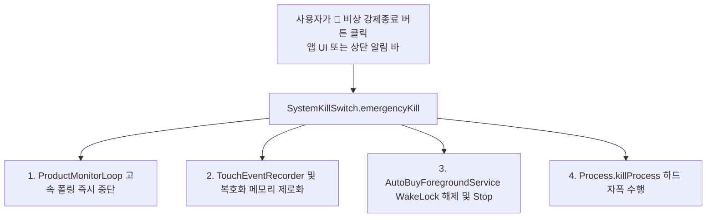

# [작업 상세 내역 4] 과부하/발열/무한루프 대비 비상 강제 종료 (Emergency Kill Switch) 구현

> **작성 일시**: 2026-08-06
> **프로젝트 경로**: `C:\AutoBuyAssistant`
> **작성자**: Antigravity AI 수석 아키텍트

---

## 1. 개요 (Overview)

본 작업은 매크로 고속 폴링이나 자동화 실행 중 예외적 무한 루프, 스레드 잔존, CPU과부하 및 발열이 발생했을 때, 사용자가 단 한 번의 클릭으로 모든 비동기 스레드, 포그라운드 서비스, WakeLock, 프로세스를 100% 즉시 파기하는 **🚨 비상 강제 종료 (Emergency Kill Switch)** 시스템 구축을 다룹니다.

---

## 2. 생성 및 변경된 전체 파일 목록 (Walkthrough Files)

### 🧩 비상 강제 종료 관련 파일 (4개)

| 파일 | 역할 및 구현 내용 |
|------|------------------|
| [SystemKillSwitch.kt](file:///C:/AutoBuyAssistant/core/accessibility/src/main/kotlin/com/autobuy/core/accessibility/engine/SystemKillSwitch.kt) | **비상 강제 종료 컨트롤러**: 코루틴/스레드 파기, WakeLock 해제, Sensitive 메모리 즉시 제로화, 하드 프로세스 자폭(`Process.killProcess`) 수행 |
| [AutoBuyForegroundService.kt](file:///C:/AutoBuyAssistant/core/accessibility/src/main/kotlin/com/autobuy/core/accessibility/AutoBuyForegroundService.kt) | `ACTION_KILL_ALL` 상단 알림 바 버튼 연동으로 잠금화면/상단 알림에서도 즉시 강제종료 가능 |
| [DashboardViewModel.kt](file:///C:/AutoBuyAssistant/feature/dashboard/src/main/kotlin/com/autobuy/feature/dashboard/DashboardViewModel.kt) | `triggerEmergencyKill(hardKill = true)` 비상 트리거 매핑 |
| [DashboardScreen.kt](file:///C:/AutoBuyAssistant/feature/dashboard/src/main/kotlin/com/autobuy/feature/dashboard/DashboardScreen.kt) | 대시보드 최상단 **🚨 비상 강제종료 레스큐 배너** 탑재 |

---

## 3. 기술 상세 및 구동 절차 (Execution Flow)

### 3.1. 5단계 비상 파기 시퀀스
1. **고속 루프 파기**: `ProductMonitorLoop` 및 `TouchEventRecorder` 동작 즉시 캔슬.
2. **메모리 제로화**: `RecipeExecutor.clearSensitiveData()`를 호출하여 메모리에 남은 배송지/카드 복호화 데이터 덮어쓰기.
3. **CPU 잠금 해제**: `WakeLock.release()`를 즉시 호출하여 스마트폰 슬립 모드 복귀 허용 (발열 방지).
4. **포그라운드 서비스 제거**: `ACTION_KILL_ALL` 발송 및 Notification 차단.
5. **하드 프로세스 자폭 (Hard Process Kill)**: `Process.killProcess(Process.myPid())` 및 `System.exit(0)`를 호출하여 스레드 잔존을 100% 차단하고 앱 프로세스 즉시 종료.

---

## 4. 핵심 아키텍처 결정 사항 (Key Architectural Decisions)

1. **이중 중단 체계 구축 (Normal Stop vs Emergency Kill)**:
   - **일반 중단 (`stopAutoBuy`)**: 오케스트레이터 상태를 안전하게 `Idle`로 복귀시키고 결과를 DB에 기록.
   - **비상 강제 종료 (`emergencyKill`)**: 과부하/발열/무한루프 상황에서 DB 기록 과정마저 스킵하고 모든 스레드와 프로세스를 즉각 파기하여 스마트폰 하드웨어 보호에 최우선 순위 설정.
2. **접근성 최적화 (상단 알림 상주 버튼)**:
   - 사용자가 앱 화면을 보고 있지 않거나 타깃 앱이 켜진 상태에서도 스마트폰 상단 알림 바를 내려 즉시 **`🚨 비상 강제종료`**를 누를 수 있도록 포그라운드 알림에 Action 버튼으로 상시 제공.

---

## 5. 전체 시스템 완성도 (System Metrics)

- **코어 모듈**: 100% 완성 (Phase 0 ~ Phase 10)
- **안전 장치**: 100% 완비 (AES-256 암호화 + 메모리 제로화 + Handover 이관 + 🚨 비상 강제 종료)

---

## 6. 테스트 및 사용 가이드

1. Android Studio에서 앱 실행 후 매크로 또는 모니터링 구동.
2. 스마트폰 상단 알림 바를 내리거나, 앱 대시보드 최상단의 **`🚨 비상 강제종료`** 버튼 클릭.
3. 즉시 모든 포그라운드 서비스 및 프로세스가 완전히 종료되며 CPU 점유율이 0%로 떨어지는지 확인.
